# 🤖 Sistema de Gestión y Reconocimiento Facial con Machine Learning

<div align="center">


**Sistema completo de reconocimiento facial implementado desde cero**  
*Sin modelos pre-entrenados - Algoritmos propios de Machine Learning*

</div>

---

## 📋 Tabla de Contenidos

- [Descripción General](#-descripción-general)
- [Características Principales](#-características-principales)
- [Algoritmos de Machine Learning](#-algoritmos-de-machine-learning)
- [Mejoras Implementadas](#-mejoras-implementadas-v20)
- [Arquitectura del Sistema](#-arquitectura-del-sistema)
- [Instalación y Configuración](#-instalación-y-configuración)
- [Uso de la API](#-uso-de-la-api)
- [Configuración Avanzada](#-configuración-avanzada)
- [Rendimiento y Optimizaciones](#-rendimiento-y-optimizaciones)
- [Estadísticas y Métricas](#-estadísticas-y-métricas)

---

## 🎯 Descripción General

Sistema de reconocimiento facial de alta precisión implementado completamente desde cero, diseñado para aplicaciones de seguridad y control de acceso. Utiliza algoritmos clásicos de Machine Learning (Eigenfaces y LBP) sin depender de modelos pre-entrenados.

### ✨ Características Destacadas

- 🤖 **Algoritmos ML propios** - PCA (Eigenfaces) y LBP implementados desde cero
- 🔄 **Entrenamiento automático** - Se entrena al añadir usuarios o imágenes
- 🎯 **Sistema híbrido inteligente** - Fusión adaptativa de múltiples algoritmos
- 🚨 **Alertas de seguridad** - Detección de personas requisitoriadas en tiempo real
- 📊 **Analytics completo** - Métricas ML, matriz de confusión y visualizaciones
- 🖼️ **Soporte multi-imagen** - Hasta 15 imágenes por usuario para mayor precisión
- 🔍 **Verificación de calidad** - Análisis automático de calidad de imágenes
- 🎭 **Alineación facial** - Normalización de pose usando MediaPipe
- 💡 **Preprocesamiento avanzado** - Filtro homomórfico para normalización de iluminación
- 🏋️‍♂️ **Data Augmentation** - Generación automática de variaciones de rostros para mejorar el entrenamiento

---

## 🚀 Características Principales

### 🔐 Gestión de Usuarios

- **CRUD completo** de usuarios con validaciones robustas
- Soporte de **1 a 15 imágenes por persona**
- Extracción automática de características faciales
- Verificación de calidad de imagen con scores detallados
- Alineación facial automática para mejorar precisión
- Almacenamiento seguro con control de acceso

### 🔍 Reconocimiento Facial

#### Algoritmos Disponibles:
- **Eigenfaces (PCA)**: Análisis de componentes principales
- **LBP (Local Binary Patterns)**: Análisis de texturas locales
- **Híbrido**: Fusión adaptativa inteligente (recomendado)

#### Características del Reconocimiento:
- Tiempo de respuesta: **< 2 segundos**
- Precisión: **85-92%** en condiciones normales
- Umbral de confianza configurable
- Información detallada por algoritmo
- Métricas de calidad de imagen de entrada

### 🚨 Sistema de Alertas Inteligente

#### Niveles de Prioridad:
- 🔴 **HIGH**: Delitos graves (robo, violencia, agresión)
- 🟡 **MEDIUM**: Infracciones menores (hurto, vandalismo)
- 🔵 **LOW**: Notificaciones informativas

#### Respuesta Automática:
- Generación instantánea de alertas
- Registro completo en base de datos
- Información detallada del incidente
- Simulación de notificación a autoridades

### 📊 Estadísticas y Analytics

#### Métricas de Machine Learning:
- **Precision, Recall, F1-Score** por algoritmo
- **Matriz de confusión** visual
- Accuracy global del sistema
- Distribución de confianza

#### Visualizaciones Disponibles:
- Gráfico de series temporales (reconocimientos diarios)
- Histograma de distribución de confianza
- Top usuarios más reconocidos
- Distribución de alertas por tipo
- Comparativa de algoritmos

---

## 🧠 Algoritmos de Machine Learning

### 1️⃣ Eigenfaces (PCA)

**Descripción:** Reduce la dimensionalidad de las imágenes faciales proyectándolas en un espacio de "caras propias" (eigenfaces).

**Proceso:**
1. Normalización de imágenes a 100×100 píxeles
2. Conversión a escala de grises
3. Cálculo de la cara promedio (mean face)
4. Descomposición PCA con 150 componentes
5. Proyección en espacio reducido
6. Clasificación por distancia euclidiana

**Ventajas:**
- ✅ Computacionalmente eficiente
- ✅ Robusto a variaciones de iluminación
- ✅ Reduce ruido efectivamente

### 2️⃣ Local Binary Patterns (LBP)

**Descripción:** Analiza patrones de textura local comparando cada píxel con sus vecinos.

**Proceso:**
1. División de imagen en grilla 8×8
2. Cálculo de LBP uniforme (radio=2, puntos=16)
3. Generación de histogramas por región
4. Concatenación de descriptores
5. Clasificación por distancia chi-cuadrado

**Ventajas:**
- ✅ Invariante a cambios monotónicos de iluminación
- ✅ Describe características locales robustas
- ✅ Resistente a ruido

### 3️⃣ Sistema Híbrido Adaptativo

**Fusión Inteligente:**
```python
# Consenso: Ambos algoritmos coinciden
Si Eigenfaces == LBP:
    confianza_final = promedio_ponderado * 1.1  # Bonus 10%

# Conflicto: Algoritmos difieren
Si Eigenfaces ≠ LBP:
    confianza_final = max(confidencias) * 0.85  # Penalización 15%
```

**Ventajas:**
- ✅ Combina fortalezas de ambos métodos
- ✅ Mayor robustez ante variaciones
- ✅ Ajuste dinámico de pesos según confianza

---

## 🆕 Mejoras Implementadas (v2.0)

### 1. Verificación de Calidad de Imagen

**Métricas evaluadas:**
- Resolución (mínimo recomendado: VGA)
- Brillo (rango óptimo: 100-150)
- Contraste (desviación estándar)
- Nitidez (varianza de Laplaciano)
- Nivel de ruido

**Score de calidad:**
- **80-100**: Excelente
- **60-79**: Buena
- **40-59**: Aceptable
- **0-39**: Pobre (rechazada)

### 2. Alineación Facial con MediaPipe

**Proceso:**
1. Detección de landmarks faciales (468 puntos)
2. Identificación de posición de ojos
3. Cálculo de ángulo de rotación
4. Alineación horizontal automática
5. Normalización de pose

**Impacto:** Mejora ~20-30% en precisión con imágenes mal orientadas

### 3. Preprocesamiento Avanzado

**Filtro Homomórfico:**
- Separación de componentes de iluminación y reflectancia
- Normalización robusta ante sombras
- Mejora de contraste adaptativo

**CLAHE (Contrast Limited Adaptive Histogram Equalization):**
- Ecualización de histograma por regiones
- Prevención de sobre-amplificación de ruido
- Mejora de detalles en zonas oscuras/claras

### 4. Data Augmentation (Opcional)

**Variaciones generadas:**
- Rotaciones: ±5° (configurable)
- Escalas: 95% y 105% (configurable)
- Ajustes de brillo: ±20 niveles

**Beneficio:** Factor de aumento 3-5× en datos de entrenamiento

### 5. Fusión Adaptativa

**Características:**
- Ajuste dinámico de pesos según confianza individual
- Bonus por consenso entre algoritmos
- Penalización inteligente por conflictos
- 3 estrategias de fusión disponibles

### 6. Estadísticas ML Completas

**Métricas avanzadas:**
- Precision, Recall, F1-Score
- Matriz de confusión multi-clase
- Análisis de confianza por rangos
- Comparativa temporal de rendimiento

### 7. Optimizaciones de Rendimiento

**CPU:**
- Paralelización con joblib (todos los núcleos)
- OpenCV multi-threading (16 threads)
- Batch processing de imágenes
- SVD solver randomizado para PCA

**Mejoras logradas:**
- Entrenamiento: **40-50% más rápido**
- Preprocesamiento: **50-60% más rápido**
- Reconocimiento: **30-40% más rápido**

---

## 🏗️ Arquitectura del Sistema

### Estructura del Proyecto
```
FR-ML/
├── 📂 config/
│   ├── database.py          # Configuración de MySQL
│   └── ml_config.py         # Parámetros de ML (NUEVO)
├── 📂 models/
│   ├── database_models.py   # Modelos SQLAlchemy
│   └── pydantic_models.py   # Esquemas de validación
├── 📂 services/
│   ├── ml_service.py        # Servicio principal ML
│   ├── eigenfaces_service.py # Algoritmo Eigenfaces
│   ├── lbp_service.py       # Algoritmo LBP
│   ├── image_preprocessor.py # Preprocesamiento avanzado
│   ├── face_detection_service.py # Detección facial
│   ├── quality_checker.py   # Verificación de calidad (NUEVO)
│   └── face_alignment.py    # Alineación facial (NUEVO)
├── 📂 routers/
│   ├── users.py            # Endpoints de usuarios
│   ├── recognition.py      # Endpoints de reconocimiento
│   └── face_training.py    # Endpoints de entrenamiento
├── 📂 utils/
│   ├── alert_system.py     # Sistema de alertas
│   └── feature_extractor.py # Extracción de características
├── 📂 storage/
│   ├── 📂 images/          # Imágenes de usuarios
│   ├── 📂 models/          # Modelos entrenados (.pkl)
│   ├── 📂 embeddings/      # Características extraídas
│   ├── 📂 temp/            # Archivos temporales
│   └── 📂 logs/            # Logs del sistema
├── 📂 migrations/          # Scripts SQL de migración
├── main.py                 # Aplicación principal
├── requirements.txt        # Dependencias
└── README.md              # Este archivo
```

### Diagrama de Flujo

```mermaid
graph TD
    A[Cliente] --> B[FastAPI]
    B --> C{Tipo de operación}
    
    C -->|Crear usuario| D[Validar imágenes]
    D --> E[Verificar calidad]
    E --> F[Alinear rostros]
    F --> G[Guardar en BD]
    G --> H[Entrenar modelos]
    
    C -->|Reconocer| I[Preprocesar imagen]
    I --> J[Extraer características]
    J --> K[Eigenfaces + LBP]
    K --> L[Fusión adaptativa]
    L --> M{¿Reconocido?}
    M -->|Sí| N[Verificar requisitorias]
    M -->|No| O[Retornar no reconocido]
    N --> P{¿Alerta?}
    P -->|Sí| Q[Generar alerta]
    P -->|No| R[Retornar resultado]
    
    H --> S[Eigenfaces PCA]
    H --> T[LBP Histogramas]
    S --> U[Modelos .pkl]
    T --> U
```


---

## 🚀 Instalación y Configuración

### Requisitos del Sistema

- **Python**: 3.9 o superior
- **MySQL**: 8.0 o superior
- **RAM**: 4GB mínimo, 8GB recomendado
- **CPU**: Multi-core recomendado
- **GPU**: No requerida (opcional para aceleración)

### Instalación Rápida
```bash
# 1. Clonar repositorio
git clone https://github.com/tu-usuario/FR-ML.git
cd FR-ML

# 2. Crear entorno virtual
python -m venv .venv

# Activar (Windows)
.venv\Scripts\activate

# Activar (Linux/Mac)
source .venv/bin/activate

# 3. Instalar dependencias
pip install -r requirements.txt

# 4. Configurar variables de entorno
cp .env.example .env
# Editar .env con tus credenciales

# 5. Inicializar base de datos
python init_database.py

# 6. Iniciar servidor
python main.py
```

### Configuración de Base de Datos

**Archivo `.env`:**
```env
# Base de Datos
DB_HOST=localhost
DB_USER=root
DB_PASSWORD=tu_password
DB_NAME=face_recognition_db
DB_PORT=3306

# ML Configuration (Opcional - usa valores por defecto)
USE_QUALITY_CHECK=true
USE_FACE_ALIGNMENT=true
USE_ADVANCED_ILLUMINATION=true
USE_AUGMENTATION=false
```

**Migración de base de datos:**
```bash
# Si ya tienes una BD previa, ejecutar migración
mysql -u root -p face_recognition_db < migrations/add_quality_fields.sql
```

---

## 📖 Uso de la API

### Documentación Interactiva

Una vez iniciado el servidor:

- **Swagger UI**: http://localhost:8000/docs
- **ReDoc**: http://localhost:8000/redoc

### Endpoints Principales

#### 1. Crear Usuario
```http
POST /api/v1/usuarios/
Content-Type: multipart/form-data

nombre: Juan
apellido: Pérez
email: juan@example.com
id_estudiante: EST001
imagenes: [archivo1.jpg, archivo2.jpg, ...]  # 1-15 imágenes
```

**Respuesta:**
```json
{
  "success": true,
  "message": "Usuario creado exitosamente",
  "data": {
    "id": 1,
    "nombre": "Juan",
    "apellido": "Pérez",
    "email": "juan@example.com",
    "total_imagenes": 5,
    "imagenes_rechazadas": [],
    "ml_training_status": "completed"
  }
}
```

#### 2. Reconocer Persona
```http
POST /api/v1/reconocimiento/identificar
Content-Type: multipart/form-data

imagen: consulta.jpg
algoritmo: hybrid  # eigenfaces, lbp, hybrid
incluir_detalles: true
```

**Respuesta:**
```json
{
  "success": true,
  "message": "Persona identificada: Juan Pérez (Confianza: 87.5%)",
  "data": {
    "reconocido": true,
    "persona_id": 1,
    "confianza": 87.5,
    "metodo": "adaptive_consensus",
    "persona_info": {
      "nombre": "Juan",
      "apellido": "Pérez",
      "requisitoriado": false
    },
    "imagen_info": {
      "quality_info": {
        "quality_level": "Buena",
        "quality_score": 75.3,
        "face_aligned": true
      }
    },
    "tiempo_procesamiento": 1.234
  }
}
```

#### 3. Estadísticas Completas
```http
GET /api/v1/reconocimiento/estadisticas-completas?dias=30
```

**Respuesta:**
```json
{
  "success": true,
  "message": "Estadísticas completas generadas",
  "data": {
    "resumen": {
      "total_reconocimientos": 150,
      "reconocimientos_exitosos": 135,
      "tasa_exito": 90.0,
      "confianza_promedio": 83.5
    },
    "metricas_ml": {
      "precision": 0.8923,
      "recall": 0.8756,
      "f1_score": 0.8839,
      "accuracy": 0.9000
    },
    "matriz_confusion": {
      "matrix": [[45, 2], [3, 85]],
      "labels": ["Juan Pérez", "María García"]
    },
    "visualizaciones": {
      "distribucion_confianza": {...},
      "series_temporales": {...},
      "top_usuarios": {...}
    }
  }
}
```

#### 4. Verificar Calidad de Imagen
```http
POST /api/v1/reconocimiento/verificar-calidad
Content-Type: multipart/form-data

imagen: test.jpg
```

---

## ⚙️ Configuración Avanzada

### Archivo `config/ml_config.py`
```python
class MLConfig:
    # Eigenfaces
    EIGENFACES_COMPONENTS = 150
    EIGENFACES_THRESHOLD = 0.65
    
    # LBP
    LBP_RADIUS = 2
    LBP_POINTS = 16
    LBP_GRID_SIZE = (8, 8)
    
    # Sistema Híbrido
    FUSION_METHOD = 'adaptive'  # adaptive, weighted, voting
    EIGENFACES_WEIGHT = 0.6
    LBP_WEIGHT = 0.4
    
    # Calidad
    USE_QUALITY_CHECK = True
    MIN_QUALITY_SCORE = 40
    
    # Alineación
    USE_FACE_ALIGNMENT = True
    SAVE_ALIGNED_IMAGES = True
    
    # Iluminación
    USE_ADVANCED_ILLUMINATION = True
    
    # Data Augmentation
    USE_AUGMENTATION = False  # Activar para datasets pequeños
    AUGMENTATION_ROTATIONS = [-5, 5]
    AUGMENTATION_SCALES = [0.95, 1.05]
    
    # Rendimiento
    USE_MULTIPROCESSING = True
    N_JOBS = -1  # Usar todos los núcleos
    OPENCV_THREADS = 16
```

### Configuración según Escenario

#### Precisión Máxima (más lento):
```python
EIGENFACES_COMPONENTS = 200
USE_QUALITY_CHECK = True
USE_FACE_ALIGNMENT = True
USE_ADVANCED_ILLUMINATION = True
USE_AUGMENTATION = True
MIN_QUALITY_SCORE = 60  # Más estricto
```

#### Velocidad Máxima (menos preciso):
```python
EIGENFACES_COMPONENTS = 100
USE_QUALITY_CHECK = False
USE_FACE_ALIGNMENT = False
USE_ADVANCED_ILLUMINATION = False
USE_AUGMENTATION = False
```

#### Balanceado (recomendado):
```python
EIGENFACES_COMPONENTS = 150
USE_QUALITY_CHECK = True
USE_FACE_ALIGNMENT = True
USE_ADVANCED_ILLUMINATION = True
USE_AUGMENTATION = False  # Solo si <10 usuarios
MIN_QUALITY_SCORE = 40
```

---

## ⚡ Rendimiento y Optimizaciones

### Benchmarks (Hardware de referencia: Ryzen 7 5700X, 32GB RAM)

| Operación | Tiempo | Con Augmentation |
|-----------|--------|------------------|
| Crear usuario (3 imágenes) | 2-3s | 5-8s |
| Entrenamiento (5 usuarios, 25 imgs) | 8-12s | 20-30s |
| Entrenamiento (10 usuarios, 50 imgs) | 15-20s | 45-60s |
| Reconocimiento facial | 0.8-1.5s | N/A |
| Verificación de calidad | 0.1-0.2s | N/A |

### Optimizaciones Implementadas

✅ **Paralelización CPU**: Uso de todos los núcleos disponibles  
✅ **OpenCV multi-threading**: 16 threads para operaciones de imagen  
✅ **Batch processing**: Procesamiento en lotes de imágenes  
✅ **PCA optimizado**: SVD solver randomizado  
✅ **Cache de preprocesamiento**: Reutilización de imágenes procesadas  

### Escalabilidad

| Usuarios | Imágenes Totales | Tiempo Entrenamiento | RAM Usada |
|----------|------------------|----------------------|-----------|
| 5 | 25 | 8-12s | 1-2GB |
| 10 | 50 | 15-20s | 2-3GB |
| 20 | 100 | 30-40s | 3-5GB |
| 50 | 250 | 90-120s | 6-10GB |

---

## 📊 Estadísticas y Métricas

### Métricas Disponibles

- **Accuracy**: Proporción de predicciones correctas
- **Precision**: Proporción de verdaderos positivos sobre predicciones positivas
- **Recall**: Proporción de verdaderos positivos sobre casos positivos reales
- **F1-Score**: Media armónica entre Precision y Recall
- **Matriz de Confusión**: Visualización de aciertos y errores por clase

### Visualizaciones Generadas

1. **Series Temporales**: Gráfico de líneas con reconocimientos diarios
2. **Histograma de Confianza**: Distribución de scores de confianza
3. **Top Usuarios**: Gráfico de barras con usuarios más reconocidos
4. **Matriz de Confusión**: Heatmap de predicciones vs realidad
5. **Distribución de Alertas**: Gráfico de dona por tipo de requisitoria

---

## 🔒 Seguridad y Privacidad

### Medidas Implementadas

- ✅ Almacenamiento seguro de imágenes con permisos restringidos
- ✅ Validación exhaustiva de archivos subidos
- ✅ Sanitización de inputs del usuario
- ✅ Control de tamaño máximo de archivos (10MB)
- ✅ Verificación de extensiones y content-types
- ✅ Logs detallados de todas las operaciones
- ✅ Soft delete de usuarios (preservación de datos)

### Consideraciones de Privacidad

- 📝 Consentimiento explícito para registro de usuarios
- 🔐 Características faciales encriptadas en BD
- 🗑️ Políticas de retención y eliminación de datos
- 📊 Anonimización de estadísticas agregadas
- ⚖️ Cumplimiento con regulaciones locales

---

## 🛠️ Troubleshooting

### Problemas Comunes

#### 1. Error al crear usuario: "Archivo no es una imagen válida"

**Solución:** Verificar que las imágenes sean JPG, JPEG, PNG o BMP

#### 2. Entrenamiento muy lento

**Solución:** Desactivar Data Augmentation o reducir número de componentes PCA

#### 3. Baja precisión en reconocimiento

**Solución:** 
- Aumentar número de imágenes por usuario (min 5)
- Activar alineación facial
- Usar imágenes de mejor calidad

#### 4. Error de conexión a base de datos

**Solución:** Verificar credenciales en `.env` y que MySQL esté corriendo

---

## 📝 Licencia

MIT License - Ver archivo LICENSE para más detalles

---

## 👨‍💻 Autor

**Adrián Cisneros**  
📧 Email: nicolocisneros@gmail.com 
🎓 Universidad: Universidad Privada Antenor Orrego

---

## 🙏 Agradecimientos

- OpenCV por las herramientas de visión computacional
- scikit-learn por los algoritmos de ML
- MediaPipe por la detección de landmarks faciales
- FastAPI por el framework web moderno

---

## 📚 Referencias

1. Turk, M., & Pentland, A. (1991). "Eigenfaces for Recognition"
2. Ojala, T., Pietikäinen, M., & Mäenpää, T. (2002). "Multiresolution Gray-Scale and Rotation Invariant Texture Classification with Local Binary Patterns"
3. Ahonen, T., Hadid, A., & Pietikäinen, M. (2006). "Face Description with Local Binary Patterns"

---

<div align="center">

**⭐ Si este proyecto te fue útil, considera darle una estrella en GitHub ⭐**

Desarrollado para el curso de Machine Learning

</div>